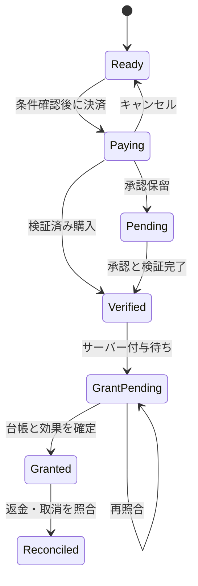

# ソードクレスト 課金設計書

作成日・レビュー日：2026-10-08（日本時間）／版：v0.3／状態：セルフレビュー反映済み・実装／経済検証待ち

v0.3（2026-10-08）：開発者の決定を反映。①固定刻みは0.05秒（§4.2）、②ランキング・対人・トレードは設けず、ゲーム進行は端末のセーブを正とする。サーバーで正本にするのは購入・権利・有償の残高・拡張台帳だけ（§1、§7、§8.1）。

本書は、既存の無料テスト用ショップを本番課金へ移行し、特殊ジョブ・特殊キャラ・追加商品を段階的に導入するための設計書である。設計書の作成は、実装・販売開始・価格確定を意味しない。

## 1. 設計の結論

- 課金の柱は「周回の利便性」「育成の短縮」「収集・編成の拡張」「外見・世界観」とする。
- 自動周回100回・戦闘5倍速・確定強化石・仲間BOX拡張を既存仕様に合わせて具体化する。
- 特殊ジョブは特定条件でのソロ適性を売り、特殊キャラは初期育成・専用外見・背景を売る。全役割を兼ねる最強商品にはしない。
- 通常職・一次職の極み・装備収集を長く使える状態を保つ。課金だけが必須となる攻略条件を作らない。
- 初回販売は買い切り商品を中心にする。消耗品は付与・消費のサーバー管理が完成してから販売する。
- ランキング・対人・トレードなど、他のプレイヤーと比べたり受け渡したりする機能は設けない（2026-10-08決定）。進行（Lv・装備・踏破・通常の強化石）を改ざんしても影響は本人だけなので、進行は端末のセーブを正とし、サーバーで戦闘を再計算しない。サーバーが正本として持つのは、お金が関わる購入・権利・有償の確定強化石の残高・BOX拡張などの台帳だけとする（§8.1）。
- 将来商品まで本書で設計するが、一括公開しない。「冒険者ギルドからのお知らせ」で段階的に案内する。

## 2. 参照元と仕様ステータス

参照リポジトリ：`nova-xx-zz/ios-hackslash-prototype`

確認コミット：`dbf37c27f5eae954d0bef0c28cfad7e442b9c0ca`（2026-10-08確認）

| 参照元 | 確認した内容 |
| --- | --- |
| `docs/requirements.md` §3.6、3.11、3.12、3.14〜3.19 | 強化、周回、保存、一次職、告知、ショップ |
| `docs/production-plan.md` §2〜5、5.7 | Capacitor・Firebase・RevenueCat、サーバー正本、経済試算、既存商品 |
| `docs/basic-design.md`、`docs/detailed-design.md` | 状態管理、強化計算、オフライン精算 |
| `js/data.js` | 商品ID、仮価格、回数・速度・BOX上限、強化定数 |
| `js/core/enhance.js` | 確定強化石の必要個数・無償優先消費 |
| `js/model/shop.js` | 購入制限、購入履歴、解放権 |
| `js/model/run.js` | オフライン進行との接続 |

### 2.1 現行と本書の区別

| 項目 | 現行仕様 | 本書での扱い |
| --- | --- | --- |
| プレイ構成 | 5人パーティ、4チーム並行探索。対人戦のない1人用ゲームとして本番方針を策定 | 維持。出撃人数や並行チーム数を課金で増やさない。ランキング・対人・トレードは設けない |
| 自動周回 | 無料範囲は1／3／5／10／20／50回 | 無料50回を維持。有料100回を追加 |
| 戦闘速度 | 無料1・2倍、有料相当3・5倍 | 無料範囲を維持。新規販売は5倍商品を優先し、3倍も含める案。独立3倍商品の販売は保留 |
| オフライン | 最大8時間、1倍相当の所要時間で精算 | 全ユーザー共通。高速戦闘は適用しない |
| 確定強化石 | 段階別個数で必ず＋1、通常石を消費しない | 維持。11個パックは現行どおりpaid＋11。別の無料配布はfreeへ記録 |
| 通常強化 | ＋99まで。失敗で天井を蓄積 | 維持。失敗保護石は現行の失敗ペナルティに必要性がないため販売対象外 |
| 仲間BOX | 基本50、＋50ずつ、最大1000 | 維持。人間・テイムモンスター共通 |
| 装備倉庫 | 有料枠の前提となる装備所持上限は未導入 | 制限を新設して売る必要があるため後続検討 |
| ショップ決済 | 2回押しで無料付与。履歴は端末セーブ | 本番では決済確認後のサーバー付与に置換 |
| 新商品 | 特殊ジョブ・特殊キャラ等は未実装 | 新規設計案。性能値・価格・公開日は暫定 |

## 3. 無料範囲と商品一覧

価格は既存の仮表示または新規の設計候補であり、App Storeで設定可能な価格の確認・経済検証を経て決める。実画面にはStoreKit／RevenueCatから取得したローカライズ価格を表示し、表の金額を固定表示しない。

R0＝課金なしの検証、R1＝最初の本番販売、R2＝消耗品・ビルド商品の追加、R3＝継続運営後の追加。日程は未確定。

| 商品キー | 商品名 | 方式 | 仮価格 | 公開段階 | 状態 |
| --- | --- | --- | ---: | --- | --- |
| `auto_repeat_100` | 自動周回100回 | 非消耗型・買い切り | 480円 | R1 | 既存を本番化 |
| `battle_speed_3` | 戦闘3倍速 | 非消耗型・買い切り | 370円 | R0のみ | 内部IDを維持、新規本番販売は保留 |
| `battle_speed_5` | 戦闘5倍速（3倍も利用可） | 非消耗型・買い切り | 610円 | R1 | 新たな販売構成案 |
| `roster_box_50` | 仲間BOX＋50 | 消耗型・拡張を永続記録 | 250円 | R2 | 既存を本番化 |
| `guaranteed_stone_1` | 確定強化石1個 | 消耗型 | 160円 | R2 | 既存を本番化 |
| `guaranteed_stone_11` | 確定強化石10個＋1個 | 消耗型 | 1,600円 | R2 | 既存を本番化 |
| `cosmetic_guild_01` | 冒険者の外見セット | 非消耗型・買い切り | 480円 | R1 | 新規案 |
| `guild_support_01` | ギルド支援セット | 非消耗型・買い切り | 480円 | R1 | 新規案 |
| `preset_pack_01` | 編成・装備プリセット拡張 | 非消耗型・買い切り | 480円 | R2 | 新規案 |
| `job_pilgrim_unlock` | 特殊ジョブ「巡礼剣士」早期解放 | 非消耗型・買い切り | 980円 | R2 | 名称・性能とも仮案 |
| `character_rio_01` | 特殊キャラ「灰剣のリオ」 | 非消耗型・買い切り | 980円 | R2 | 名称・内容とも仮案 |
| `appearance_ticket_1` | 外見変更券1枚 | 消耗型 | 160円 | R3 | 外見編集導入後 |
| `inventory_pack_01` | 装備倉庫拡張 | 非消耗型の段階商品 | 未定 | R3 | 所持上限の設計が先 |
| `story_pack_01` | 外伝パック | 非消耗型・買い切り | 未定 | R3 | ストーリー制作後 |
| `season_pass_01` | シーズン報酬パス | シーズンごとの非消耗型 | 未定 | R3 | 運営負荷確認後 |
| `stone_pass_30d` | 30日強化支援パス | 非更新型の期間商品 | 未定 | R3 | 経済検証待ち |

商品キーはゲーム内部のID。Appleの商品ID案は `com.nova.swordcrest.iap.<商品キー>` とし、ストア登録時に確定する。既存の内部IDは移行のため保持する。

## 4. 商品詳細

### 4.1 自動周回100回

- 効果：1チームが設定できる連続周回上限を50から100へ拡張。全4チームで使用可能。
- 購入条件：`inferno_peak`（業火の霊峰）をノーマルで踏破。購入前にサーバーの踏破記録で判定する。
- 新規ルール案：自動周回の開始対象は、そのモードで踏破済みのダンジョンに限定する。無料回数にも共通適用し、既存自動周回との挙動差をリリース前に明示する。
- 100回は戦闘を100周実行する設定であり、即時の報酬受取ではない。
- 100回には最初の1周を含む。開始済み1周と、終了後の追加99周を合わせて100周とし、101周になる実装を許容しない。
- 踏破した周だけ装備・テイムを確定。全滅時に停止し、勝利済み戦闘のEXPは維持する。
- 無料の1〜50回は取り上げない。購入してもドロップ率・報酬倍率・並行チーム数は変えない。
- 停止理由を「完了／全滅／手動停止／容量上限／権利確認待ち」に分ける。装備容量上限による停止は倉庫仕様導入後のみ有効。
- 将来の共通機能として、レア装備獲得時停止・BOX満員時停止を追加できる。安全停止を有料限定にしない。
- オフラインは8時間か残り周回数の先に達した方で終了。部分的な1周は既存方針に従い報酬を確定しない。

### 4.2 戦闘3倍速・5倍速

- 無料は1・2倍。購入した速度だけ切替候補へ追加する。
- 5倍速商品は単独購入で3倍と5倍を利用可能とする新規案。独立した3倍商品の新規販売を初回は保留し、買い直しによる二重負担を避ける。
- `speed5` が有効なら3倍も候補へ追加する。既存の `speed3` 内部キーは互換用に保持する。プロトタイプ購入は本番購入権へ変換しない。
- 速度は全チーム共通。味方・敵の双方の戦闘時間を同じ係数で進める。
- 命中・会心・AI・敵の強さ・報酬抽選のルールは変えない。固定刻み等で同一初期状態・乱数列から行動順と勝敗が変わらないよう実装する。
- 現行 `battle.step()` は、渡されたdt単位で味方を先に処理し、ATB超過分を捨てる。画面で進む戦闘（`js/ui/explore.js` の `loop`）は、1フレームの経過時間に速度を掛け、0.05秒以下に分けて `step()` を呼ぶ。刻み幅はフレームの間隔で変わるため、**速度1倍でも端末の描画速度によって行動順・勝敗が変わり得る**。オフライン精算とシミュレーターは0.05秒固定なので、速度商品がなくても画面の戦闘とオフラインの結果が少しずれる。速度商品の有無にかかわらず現行の課題であり、速度商品を本番化する前に、ゲーム内の固定刻みと時間蓄積器へ切り替える。速度は1フレームに実行する刻み数を増やすために使い、1刻みのdtを変更しない。
- **固定刻みの幅は0.05秒に決定**（2026-10-08）。オフライン精算・シミュレーターと同じ幅で、難易度の調整（全35ダンジョン×3モード）もこの幅で行っているため再調整が要らない。0.01秒は計算量が5倍になり（4チーム×100周のオフライン精算）、再調整も必要になる割に、体感の差はほとんどない。行動1回は序盤で約48刻み・終盤で約10刻みで、ATB超過分を捨てることによる差は数%だが、画面・オフライン・シミュレーターのすべてで同じように効く。
- 同じ刻みで行動可能な者の順序を固定し、処理上限で未消化となった時間は次フレームへ持ち越す。画面の戦闘・オフライン精算・シミュレーターで同じ戦闘実行方式を使う。
- 乱数はチームごとに分離したストリームを使う。4チームが共有乱数を消費する順序や、表示チームの変更で別チームの勝敗・ドロップが変わらないようにする。
- 同一条件比較は同じ戦闘マスター版・刻み・seedで行う。石碑等の現行オンライン／オフライン差は残るため、道中イベントまで含めた両者の完全一致は約束しない。
- オフライン精算は1倍相当。商品説明に「アプリ表示中の戦闘に適用。オフラインの獲得量は増えません」を表示する。
- 3倍と5倍は乗算しない。別のパスやキャラ能力でも5倍を超えない。
- 初回R1では速度＋周回の割引セットを作らない。重複購入やセット価格差の処理を増やさず、単品で理解できる構成にする。

### 4.3 確定強化石

呼称は「確定強化石」に統一し、「強化100%石」は説明上の別名とする。通常の「強化石」と別の残高で管理する。

```text
p = 通常強化成功率（レア度・現在の＋値による）
c = 通常強化1回で消費する強化石数
E = c / p
必要個数 = max(1, ceil(E / 10000))
```

- 対象は既存強化に対応した装備の＋0〜＋98。必要個数を使い必ず＋1。＋99では使用不可。
- 通常の強化石や別通貨を追加消費しない。現行仕様にないゲーム内通貨を本書では追加しない。
- 対象装備・現在値・上昇後・必要個数・所持数・無償／有償の消費内訳を確定前に表示する。
- 必要個数は1個固定ではない。LR＋98→＋99は10個。1個商品にもこの点を明記する。
- 無償分を先に消費し、不足分だけ有償分を使う。残高不足・探索ロック・上限では一切消費しない。
- 成功時は当該装備の天井蓄積を0へ戻す。通常強化で次回天井成功が確定している場合、先に通常強化を案内する。
- 有償・無償の残高減算と消費履歴（操作ID・対象装備ID・強化前の＋値・必要個数）を同一のサーバートランザクションで確定する。装備と＋値は端末のセーブにあるため（§8.1）、端末はサーバーの成功結果を受け取ってから＋1と天井リセットを反映する。同じ操作IDの再送には前回の結果を返し、反映済みかを端末側でも操作IDで判定する。古いセーブを復元して＋値が戻っても、消費した石は戻さない（復元前に案内する）。
- ボタン連打、タイムアウト、再送でも同じ操作IDでは1回しか強化しない。
- 11個パックは現行どおり `paid += 11` とする。「おまけ1個」という販売表現だけでfreeへ分類しない。freeは別途行う無料配布を記録する区分とし、会計・法的な分類の判断をこの変数名だけで確定しない。
- アイテム残高には本設計で有効期限を設定しない。期間イベント終了で取得済み残高を消さない。

無料配布の基準案は継続プレイ月15個。例：累積ログイン報酬4個、月間冒険実績6個、イベント5個。イベント不開催月も代替実績で5個を確保する。初回踏破・初LR入手などの初回報酬は別枠とし、月15個は毎月自動支給される数量とは扱わない。無料配布機構は現行未実装。

既存の天井を維持する。強化失敗時は強化値低下・装備消失を新設せず、課金の必要性を高めるための罰を追加しない。

### 4.4 仲間BOX＋50

- 基本容量50、1回＋50、最大1000。出撃枠・並行チーム数は増えない。
- 既存のキャラ作成枠とテイム枠を共通で拡張する。別の「キャラ枠商品」は重複して販売しない。
- 初回50から通常は19回の購入で最大。以後は購入開始を拒否する。
- 消耗型商品の決済1件ごとに拡張回数をサーバー台帳へ永続記録する。残りチケット数だけで復元しない。
- 決済前に容量と処理中購入を確認し、同時に開始する拡張購入はアカウントで1件に制限する。
- 遅延決済や多端末の競合で支払済みの＋50が上限を超える場合は、未適用拡張権として台帳に残し、黙って失効させない。問い合わせ・返金案内の対象として記録する。
- 満員時の作成不可・テイム抽選停止を、探索開始前と結果画面で知らせる。自動的に仲間を削除しない。
- 返金等で容量が減っても、すでに所持している仲間は保持し、新規追加のみ制限する。
- 無料でプレイ・5人編成・4チーム運用を成立させる50枠を維持する。テイムできる種族は37種（図鑑の200種は出会った敵の記録で、所持は不要）なので、初期の5人と合わせて42人となり、基本の50枠に収まる。人間の仲間を増やす・同じ種族を複数育てる場合に拡張が必要になる。収集のために拡張を必須にしないことを維持し、収集導線の課金圧を評価する。

### 4.5 特殊ジョブ「巡礼剣士」（仮）

目標：通常難度の得意な周回先で単独運用できる自己完結型。高難度では編成の工夫が必要となる。

| 要素 | 役割案 | 制約 |
| --- | --- | --- |
| 単体攻撃 | 剣による持続的な攻撃 | 同条件の物理専門職を全場面で上回らない |
| 吸収攻撃 | 敵へ与えたダメージに応じて自己回復 | 与ダメージ依存、MP消費あり、最大HPを超えない |
| 生存手段 | 自己防御の選択肢 | 全体回復・蘇生・味方支援を同時に充実させない |
| 苦手条件 | 多数敵、物理が通りにくい相手、長期のMP不足 | 苦手条件を有料専用スキルで消さない |
| スキルツリー | 固有1本＋汎用3枠 | 通常と同じSP量・レベル上限。全系統のブック適性を付けない |

- 無料解放：ノーマルの深淵の心臓踏破後のジョブクエスト達成（新規案）。クエストは一次職を使う編成でも達成可能とする。
- 有料早期解放：業火の霊峰ノーマル踏破後に購入可能。購入と無料解放で得られるジョブ性能は同じ。
- 無料解放済みなら購入不可。購入後に無料クエストを達成しても重複権利・強化ボーナスを付けない。
- 解放根拠は `jobUnlockSources[jobId] = { questCompleted, activePurchaseIds }` として個別に保持する。有料購入が取り消されても、無料クエストを達成済みならジョブは利用できる。
- 無料条件未達のまま取消となった場合は新規転職と新規出撃を停止する。探索中は次の周を開始せず、終了後に利用可能な前職へ戻す。特殊職のLv・EXP・ツリー配分を保管し、再解放時に復帰する。
- 他職へ引き継ぐサブアビリティ・ブック適性・装備条件にも同じ解放根拠の判定を適用する。ジョブ画面だけを閉じても効果が残る抜けを防ぐ。装備を外す際は所持品へ移す。
- 「どこでも1人でクリア」「最強」とは販売説明しない。検証済みのソロ適性だけ記載する。
- ソロ時も通常の敵数・抽選回数・周回報酬を使う。5人分の経験値を1人へ合算しない。
- 現行のEXP配布方式を変える場合は、特殊職だけの特典ではなくゲーム全体の別設計として扱う。
- 1人で4チームを同時運用できるようにはしない。同じキャラの多重所属は禁止する。
- 数値・技名は後続のジョブ設計で決める。職を追加するだけで既存の吸収職や一次職を完全に置き換えないことを公開条件にする。

### 4.6 特殊キャラ「灰剣のリオ」（仮）

- 固定の外見・背景・演出と、Lv10の育成済みキャラ1人を提供する。
- 同じジョブ・種族・Lv・装備・SPなら、通常キャラと同じ最終性能計算を使う。初期ステータスの高さはLv10による差とする。
- 初期SPはLv10に対応する9。推奨配分はLv10で解放済みのノードだけに適用し、前提・排他・レベル条件を満たさない分は未使用SPに残す。Lv20以降の技を先行付与しない。
- 初期装備はその時点で無料入手できる品質に限定。LR・最高強化・有料専用セットは付けない。
- 「良いスキル」は推奨ビルドを組んだ初期設定で実現し、他キャラも同じ効果に到達できる。専用スキル演出は性能と分離する。
- 特殊ジョブの解放権は含めない。パーティ全体の報酬倍率・ドロップ率も付けない。
- 購入条件案は、はじまりの草原のノーマル初回踏破。Lv10が推奨Lv11の遺跡踏破後には育成短縮になりにくいため、前版の遺跡条件を撤回する。序盤を短縮する影響は別に検証し、実証前に育成短縮効果を保証しない。
- 1アカウント1人。購入権・付与ID・キャラIDを関連付け、復元で再生成しない。
- BOX満員なら受取待ちとして保管し、空きができてから1人を付与する。購入内容が消失する扱いにしない。
- 有料キャラは消去する「仲間と別れる」の対象外とし、代わりにコレクションへ退避できる。チーム所属・探索中なら退避不可。退避は同じキャラID・育成状態を保存し、BOX枠を使わない。
- 退避時は装備を所持品へ移し、復帰時に初期装備を再発行しない。復帰はBOX空き枠が必要。1回限りの付与IDを保持し、復元や退避の反復でキャラ・装備・SPを複製しない。
- 初期パーティや一次職を十分育てれば競合できる性能とする。

### 4.7 外見セット・ギルド支援セット

- 外見セット：立ち絵／武器の見た目／紋章など、制作できた内容を確定して販売する。対応キャラ・職と装備条件を購入前に表示する。
- ギルド支援セット：専用称号・プロフィール紋章・ギルドからの感謝文。ステータスやドロップ率の補正は付けない。
- 両商品の収録物を重複させない。「支援」という名称でも、何が得られるかと買い切りであることを明示する。
- 購入権は永続。機能を一時停止しても取得済み外見の使用は維持できるようにする。

### 4.8 プリセット・外見変更・装備倉庫

- プリセット案：無料3枠、買い切りで合計10枠。枠は全アカウント共通で、並行チーム数には影響しない。
- 編成・装備・スキル設定の保存だけを扱う。装備やスキルブックを複製しない。
- プリセット適用でも探索ロック・装備適性・本の消費を検証する。将来のブック交換費用を回避する機能にしない。
- 外見変更券は容姿変更のみ。ジョブ変更・種族特性変更・能力値再抽選は含めない。名前変更は無料とする案を採用。
- 装備倉庫は現行の無制限所持を有料化する変更になるため、容量・無料拡張・上限超過時の保持を別途設計するまで販売しない。
- 旧セーブの装備を削除せず、最低でも既存所持数を保持する移行が必要。満杯時のドロップ消失を課金の誘導に使わない。

### 4.9 外伝・シーズン・30日支援パス

- 外伝：追加の物語・ダンジョン・外見報酬。無料本編の完結を有料外伝の購入条件にしない。有料限定の必須対策装備や最強性能は置かない。
- シーズンパス：シーズンごとに無料報酬と有料の外見報酬列を設ける。購入時点までの達成報酬は遡って受取可能。終了後も取得済みの外見は保持する。
- シーズン終了後に未受取の達成済み有料報酬を失わせず、サーバーで確定し受取箱へ送る。日程・達成条件・遡及範囲を購入前に明示する。
- 30日支援パス：1日1個、合計30個の確定強化石を付与する案。初期段階では自動更新しない。
- 30日はサービスの付与期間。付与済み石に期限は付けない。日数はサーバー時刻から判定し、ログインしない日も累積して次回受け取れる。
- 日数は購入確定時刻t0から24時間ごとの30区間。付与済み日数は `min(30, 1 + floor((serverNow - t0) / 24時間))`（t0以前は0）とする案。1個目はt0時点、30個目は29日後。更新対象のdayIndexと購入IDで一意化する。
- 30個は購入に基づくpaidの付与として、購入IDと関連付けて記録する。受取画面は表示用で、同じ日の再受取を残高へ加算しない。
- 同時に有効なパスは1件。t0＋30日以降のみ再購入でき、期間を重ねない。取消では未付与日を停止し、付与済み分は同じ購入ロットの返金処理で照合する。
- 継続報酬の制作体制と経済効果を確認するまで、上記3商品は販売しない。

## 5. 経済・バランスの検証条件

### 5.1 先に認める影響

自動周回100回は、ログイン回数が同じなら稼げる上限を増やす。高速戦闘はオンラインでの単位時間あたりの報酬を増やす。確定強化石は直接育成時間を短縮する。これらを「性能に影響しない」とは説明しない。同じ最大強化値へ到達できることと、到達時間が同じであることは別である。

### 5.2 現行試算の扱い

本番化方針の2026-10-07試算には、余裕を持った周回・1日3回ログイン・無料15個／月の条件でLR1個の＋99が中央値約40日、1日1回で約102日という結果がある。旧来の「無課金3〜4か月」は条件次第で一致しない。これは参照元の試算であり、本書で新たに再実行した実測ではない。

現行定数ではLR＋0→＋99を確定強化石だけで進める必要数は303個。11個パックだけなら28パック・44,800円（5個余り）。単品を併用する仮価格の最少額は27パック＋6個・44,160円。これは全段を購入品だけで上げる試算であり、推奨購入額や通常のプレイ費用ではない。装備7枠の育成へ波及するため、課金前提の難度を設定しない。

安定して踏破できる場合の1回の設定による周回数は、概ね `min(設定回数N, floor(利用可能時間B / 1周所要時間t))`。オンラインのtは戦闘時間を速度で短縮した分と、短縮しない画面遷移・待機時間の合計。オフラインのtは1倍相当。100回と5倍の効果を単純に2倍×5倍として試算しない。無料2倍との速度比較も必須とする。

### 5.3 比較するシナリオ

| 軸 | 比較値 |
| --- | --- |
| 課金状態 | 無料／100回のみ／5倍のみ／両方／確定石70個追加／30日パス案／全部 |
| ログイン回数 | 1日1回・3回 |
| チーム数 | 1・4 |
| オンライン時間 | 0分・30分・120分 |
| 周回先 | 適正ノーマル・余裕のあるノーマル・ハード・エクストラ |
| 編成 | 通常5人・特殊職入り5人・特殊職ソロ・育成済み特殊キャラ入り |
| 育成 | 序盤・中盤・終盤、同レベル／同装備／同SPの比較 |

測定値：踏破率、全滅までの周回数、EXP／日、強化石／日、装備／日、LR1個＋99までの日数、特定ビルドの攻略可能範囲、処理時間・サーバー費用。

同一乱数列で戦闘速度別の結果を比較し、経済試算は複数seedで中央値・10〜90%区間を出す。`tools/economy.js` と `tools/progression.js` に上記条件がない場合は拡張してから評価する。現行スクリプトで商品全部を検証済みとは扱わない。

### 5.4 公開判断の暫定基準

- 無課金の通常編成が全無料コンテンツを攻略できる。特殊職・キャラ専用の必須耐性を設けない。
- 特殊職は同資源条件で専門職の火力・回復・耐久をすべて同時に上回らない。得意・苦手の結果が比較表に現れる。
- ソロ周回が通常5人編成をすべての周回先で上回るなら公開しない。
- 100回は50回に対して設定回数の上限が2倍になる商品。各周のドロップ・EXP倍率は変えない。1日の獲得量は速度・ログイン・全滅・所要時間に依存し、2倍と保証しない。
- 速度別の同一戦闘で行動順・勝敗が変わる不具合があれば5倍速を販売しない。
- 到達期間は既存の3〜4か月という目標と約40日／102日の試算が一致していないため、要決定の販売ゲートとする。前版で追加した30〜60日を確定目標として採用しない。比較条件・許容期間・無料対有料の短縮幅をレビューで決め、試算が範囲に入るまで石・100回・5倍の販売を開始しない。
- 課金商品の組合せで進行が早すぎる場合、初回は公開商品を絞る。無料回数・既存ドロップ率を販売都合だけで下げない。
- ランキング・対人・トレードは設けない（§1）。方針を変える場合は、課金による育成速度差の公平性と、進行のサーバー管理（§8.1で採らなかった方式）を含めて別途設計する。

## 6. ショップ画面と導線

通常導線はギルド／設定からショップ。周回100回のロック、速度切替、強化石不足、BOX容量画面から該当商品の説明へ移動できる。

商品カテゴリは「冒険を快適に」「育成の支援」「仲間と収集」「外見とギルド支援」「追加の冒険」とする。公開商品のあるカテゴリだけ表示する。

商品カードには、名称・具体的効果・数量・買い切り／消耗／期間・取得価格・購入条件・購入済み状態を表示。必要に応じてオフライン対象外、無料解放経路、受取待ちを明示する。

購入前説明例：

> 自動周回100回：各チームの連続周回に100回を追加する買い切り機能です。無料の50回も引き続き使えます。全滅すると停止します。即時に100回分の報酬を受け取る機能ではありません。

> 確定強化石1個：必要個数を使って装備を必ず＋1強化できます。必要個数は装備と現在の強化値で変わります。LR＋98→＋99には10個必要です。

共通ルール：決済中は連打不可。保留は「購入確認待ち」、決済済み・付与待ちは「受取処理中」。付与待ち状態で再購入を誘導しない。全滅直後に自動購入モーダルを出さない。未公開商品は購入ボタンや価格を出さず、告知で予告する。

ショップと設定に「購入を復元」「購入履歴・受取状況」「お問い合わせ」を用意。石不足の案内には通常強化と無料入手方法への導線も置く。

## 7. 購入・付与・復元の技術設計

### 7.1 採用構成

既存方針のCapacitor＋Firebase Authentication／Firestore／Cloud Functions＋RevenueCatを維持する。RevenueCatは購入情報と買い切り権利の管理に使い、有償アイテムの付与・消費・拡張回数はゲームサーバーの台帳を正本にする。戦闘報酬・進行は端末のセーブを正とし、サーバーで確定しない（§8.1）。[外部資料1・2]

購入前にApple等で引き継ぎ可能なゲームアカウントへ連携する。サーバーが不変のbillingId（UUIDv4）を発行し、Firebase uidと1対1で関連付け、RevenueCatのApp User IDに利用する。端末セーブから提出されたuid・billingIdを信用せず、認証トークンから解決する。アカウントの変更・統合は別の移行処理で行う。

全購入前のアカウント連携を前提に、RevenueCatの復元設定は `Keep with original App User ID` を本書の案とする。匿名購入を許可する方針に変える場合は、この設定を再設計する。Apple Accountが同じでも異なるゲームアカウントへ自動転送しない。復元・新規購入時に元のゲームアカウントへの復帰導線を出す。[外部資料4・5]

`appAccountToken` とbillingIdの対応、SDKの送信値、サーバー通知由来の購入検出設定をSandboxで確認する。通知とSDKで別ユーザーに購入が登録される構成を販売しない。Family Sharingは初回では有効化しない。アカウント復帰不能・削除後再作成の扱いはサポート手順を定義してから販売する。

### 7.2 購入状態



1. サーバーで公開状態、購入条件、所有・上限、アカウントを確認する。
2. SDKから取得した商品・価格でAppleの購入画面を開く。
3. キャンセル・承認待ちでは付与しない。クライアントの「成功」通知だけでも付与しない。
4. 検証済み購入をサーバーで取得し、product ID・bundle・環境・所有アカウント・取消状態を照合する。
5. 正規化した取引IDの台帳を読み、未付与なら決済時の商品契約スナップショットに従って効果と台帳を原子的に更新する。現在の商品価格・数量・販売フラグで過去の契約を書き換えない。
6. サーバー結果を取得してゲームに反映する。再起動・再送は同じ台帳結果を返す。

RevenueCatの消耗型購入は購入イベントから付与し、消耗品の所持数を永続entitlementで表現しない。購入処理のSDKによる取引完了はSDKに任せ、アプリから同じ取引を独自に二重finishしない。SDKが取引を完了しても、Webhookとサーバー台帳による付与・回復経路が残る構成にする。[外部資料1]

### 7.3 Webhookと再照合

- 認証ヘッダー等で送信元を確認し、本番とSandboxのイベントを分離する。
- イベントを永続キューへ記録してから成功応答する。メモリだけに置いて成功応答しない。
- 同じevent IDを重複処理せず、さらにstore＋environment＋transaction IDをキーに付与を重複防止する。
- 紐付けが未解決の購入は受信台帳へ隔離し、正しいアカウントが確定してから付与する。クライアントが提示したuidへ推測で付与しない。
- 強化・キャラ受取等の操作IDはuidと操作種別の名前空間に置き、要求内容のハッシュを保存する。同じID・同じ内容には前回結果を返し、同じID・異なる内容は拒否する。更新対象のrevision・所持・探索ロックを同じトランザクションで再検証する。
- 消耗型・非消耗型・期間商品はゲームの商品マスターで種類を判定する。イベント名だけで付与量を決めない。
- 順不同で取消が先に来ても記録し、後着の購入イベントで誤って付与しない。
- Webhook遅延・最終的な送信失敗に備え、ゲーム起動時の未付与照合、サーバー定期照合、管理者再処理を用意する。
- 即時付与を保証できない時は受取処理中を表示する。購入の取り消しや再購入を求めない。[外部資料2]
- 販売停止・価格改定・無料解放・購入条件の変化が決済中に起きても、検証済み支払を現在条件だけで拒否しない。旧版マスターを保持し、未付与契約は履行または個別の返金対応を記録する。

### 7.4 サーバーデータ案

| データ | 主な項目 | 更新権限 |
| --- | --- | --- |
| 商品マスター | internalId、storeProductId、kind、grant、条件、公開段階、version、旧版契約 | 運営のみ |
| アカウント権利 | billingId、autoRepeat100、speed3、speed5、外見、ジョブ解放根拠、キャラ購入権 | サーバーのみ |
| 購入台帳 | 取引ID、商品、数量、環境、uid、検証時刻、付与時刻、取消状態、マスター版 | サーバーのみ |
| イベント受信台帳 | eventId、受信時刻、処理状態、再処理回数 | サーバーのみ |
| 石残高・残高履歴 | free、paid、付与ロット、消費内訳、操作ID | サーバーのみ |
| 拡張台帳 | 購入ごとの＋50、適用状態、取消状態 | サーバーのみ |
| キャラ付与台帳 | purchaseGrantId、characterId、受取待ち状態 | サーバーのみ |
| ゲーム進行 | roster、inventory、踏破、ジョブ、装備、通常の強化石 | 端末のセーブが正。サーバーにはバックアップ（現行のクラウドセーブ）だけを置き、サーバーからは書き換えない |

既存の `purchases.history`（最大200件）は表示用キャッシュ。正規の会計・購入台帳として使わず、履歴の切捨てで重複防止情報を失わない。

### 7.5 復元と返金

- 非消耗型はストアの購入復元とサーバー権利の照合で回復する。
- `restorePurchases` は復元ボタンを押した時だけ呼ぶ。起動時の自動照合はゲームサーバーの権利同期とし、OSのサインインを出し得る復元処理を自動起動しない。[外部資料4]
- 確定強化石は復元操作で購入量を再加算しない。ゲームアカウントの残高・消費履歴から同期する。
- BOX拡張も使用済み消耗型として、ゲームアカウントの拡張台帳から同期する。ストア復元だけに依存しない。
- 異なるゲームアカウントへ同一取引を重複付与しない。既存アカウントへの復帰・本人確認を案内する。
- 返金・取消後は該当の買い切り権を再計算する。高速設定は利用可能な速度へ戻す。
- 特殊ジョブの無料解放・購入解放をORで再計算する。課金取消だけで無料クエストの達成記録を消さない。
- 周回権を失った場合、完了済み報酬を取り上げず、進行中の1周終了後に上限50の範囲へ再設定する。
- 石は購入ロット単位で未使用分を取り消す。使用済み分がある場合は調整状態を記録し、既存装備を即時削除せず個別照合する。未解決の間は当該アカウントの新規有償石消費を停止し、解決手順を表示する。
- 取消後の特殊キャラは新規出撃不可のコレクション退避として保持し、BOX枠を占有しない。探索が終わったら装備を所持品へ戻す。訂正があれば同じキャラIDを利用再開し、初期装備は再発行しない。
- アカウント削除の導線・購入権との関係・必要な取引記録の保持を販売前に定義する。[外部資料3]

## 8. オフラインと本番移行

### 8.1 オフライン中の扱いと、サーバーで持つ範囲

ランキング・対人・トレードを設けないため（§1）、サーバーで持つ範囲を段階に分けて最小にする。進行の改ざんで不利益を受けるのは本人だけなので、戦闘の再計算・実行端末の一本化（lease）・オンライン／オフライン区間の管理は行わない。

| 段階 | サーバーが正本として持つもの | 端末のセーブが正のもの |
| --- | --- | --- |
| R1（買い切り） | アカウント・billingId、購入台帳、買い切りの権利（100回・速度・外見など） | 進行のすべて（Lv・ジョブ・装備・所持品・通常の強化石・踏破・自動周回・オフライン精算） |
| R2（消耗品） | R1に加えて、確定強化石の残高（free／paid・ロット・消費履歴）、BOX拡張台帳、特殊キャラの付与台帳 | 同上（確定強化石で上げた＋値も端末に反映する。§4.3） |

- 新規購入・確定強化石の消費・BOX拡張の適用は通信必須。有償の残高はサーバーの台帳が正で、localStorage を書き換えても増えない。
- 確認済みの買い切りの権利は、サーバーが発行した署名付きの権利スナップショットを端末にキャッシュし、通信断でも表示・利用を続ける。
- オフライン精算は現行どおり端末で行う。端末の時計を進める不正（リリース前チェック RC-09）は、サーバー時刻との照合など軽い対策を別途判断する。進行の改ざんは本人にしか影響しないため、販売の条件にはしない。
- 進行のクラウドセーブ（現行の Firestore バックアップ）は進行の保存先として維持する。復元しても、サーバーの台帳にある権利・有償の残高は台帳から同期し直し、セーブ内の値を使わない。
- 機能が途中公開されても、離脱時に存在しなかった有料ジョブやスキル効果を過去の戦闘へ遡及適用しない。
- 権利の判定（100回・速度の利用可否）は端末で行う。端末を改ざんして権利を使っても本人の進行が早まるだけで、他のプレイヤーへの影響はない。購入の偽装で有償の残高・購入台帳を増やせないことだけを保証する。

### 8.2 プロトタイプ履歴の分離

- Web版で無料付与された `purchases` と `guaranteedStones.paid` は、Appleの実購入証明ではない。
- 本番では台帳の環境を `prototype`／`sandbox`／`production` に分け、production権利は検証済みproduction取引だけから作る。
- 本番アカウントの移行はサーバーで許可した進行データだけを取り込む。端末が主張する購入権・paid残高は移行しない。
- 進行を引き継ぐ場合も、無料のプロトタイプ石で上げた強化値などは実購入の証明と独立して検証する。新規開始・許可リストによる引継ぎのどちらを採るかは未決定であり、本書で既存進行のリセットを決定しない。移行方式と対象データを告知してから本番化する。
- 無料テストショップは別ビルド・別環境でのみ有効。本番でURLパラメータ・端末フラグを変えて無料購入できる経路を残さない。

## 9. 段階公開と停止

| 段階 | 公開内容 | 開始条件 |
| --- | --- | --- |
| R0 | 無料テストショップ、全商品の検証マスター | 本番権利と分離。実課金なし |
| R1 | 100回、5倍（3倍含む）、制作済み外見、ギルド支援 | アカウント連携、復元設定、返金照合、固定刻み戦闘、権利・購入台帳、経済比較 |
| R2 | 石、BOX、プリセット、特殊職、特殊キャラ | 消耗品台帳（有償の残高・操作ID）、原子付与、無料入手、職・キャラ比較、受取待ち |
| R3 | 外見変更、倉庫、外伝、シーズン、30日支援 | 各コンテンツの実装・経済と運営負荷の評価 |

R2の商品は同時公開を必須にしない。条件を満たした商品から順に公開する。既存方針の「最初の商品は確定強化石」は、本書ではR1の買い切り優先へ変更する提案である。

機能フラグは販売・未契約の新規付与・支払済み契約の履行・既存利用・周回効果・オフライン効果を区別する。販売停止は新規決済の開始だけを止め、すでに支払済みの未付与商品を失効させない。付与停止が必要な障害では受取待ち契約を保持して回復後に処理する。必要な利用停止時は権利を保持し、代替・補償方針を告知する。

告知は「予告→名称と対象→解放条件→公開時の全仕様」。公開日と価格は決定してから載せる。販売ボタンはサーバーの公開判定とストア商品取得の両方が成功した時だけ表示する。端末時計だけで解禁しない。

## 10. 受入条件

| ID | 検証 | 合格条件 |
| --- | --- | --- |
| PAY-01 | 購入キャンセル・承認待ち | アイテム・権利が付かない |
| PAY-02 | 成功通知後に通信切断・再起動 | 未付与を回復し、二重付与しない |
| PAY-03 | 同じ購入のWebhook重複・SDK再照合 | 取引台帳1件、付与1回 |
| PAY-04 | 偽通知・環境不一致・別uid | 付与拒否。Sandboxは本番に混入しない |
| PAY-05 | 買い切り復元・多端末 | 同じ権利を同期し、再購入させない |
| PAY-06 | 消耗品復元・古いセーブ復元 | 消費済み石を増やさない。BOX拡張は台帳から復元 |
| PAY-07 | 非同期返金、購入と取消の順不同 | 最終状態を正しく照合する |
| PAY-08 | プロトタイプの無料履歴を移行 | 実購入権・有償残高にならない |
| BAL-01 | 無料プレイ | 50回・2倍・通常強化・全無料ダンジョンを維持 |
| BAL-02 | 100回未購入・条件未達 | クライアント/APIとも購入・不正利用を拒否 |
| BAL-03 | 100回の全滅・中断・精算再送 | その周の未確定ドロップなし、精算は1回 |
| BAL-04 | 5倍単独購入、互換3倍と併用 | 3倍・5倍を使用可能。15倍にはならない |
| BAL-05 | 速度別の同一seed戦闘 | 同じ行動順・勝敗。オフライン収入は速度権で変わらない |
| BAL-06 | 確定強化＋99・不足・探索中 | 消費せず拒否 |
| BAL-07 | 強化同時操作・再送 | ＋1と必要数消費が1回、通常石は不変 |
| BAL-08 | 11個パック | paid＋11、freeは不変。消費はfree優先 |
| BAL-09 | BOX満員・最大容量・遅延購入 | 仲間消失なし。超過した支払分に未適用記録 |
| BAL-10 | 特殊職の無料解放後の購入 | 購入不可、性能差なし |
| BAL-11 | 特殊職ソロ／5人との比較 | 得意と苦手を確認、人数分の報酬増幅なし |
| BAL-12 | 特殊キャラの復元・BOX満員 | 同一キャラID、重複装備なし、受取待ち保持 |
| BAL-13 | プリセットの探索ロック・ブック交換 | 制約・消費を回避しない |
| OPS-01 | 未公開・販売停止商品 | 新規購入不可、既存権利は維持 |
| OPS-02 | 複数端末・古いセーブの復元と残高更新 | 有償の残高・権利・拡張台帳が巻き戻らない（進行は端末のセーブどおり） |
| OPS-03 | 30日パス・シーズン終了 | 取得済み資産保持、達成済み報酬回復 |
| PAY-09 | 別ゲームアカウントで復元・新規購入 | 設定に従い移管しない。元アカウントへ復帰案内 |
| PAY-10 | 支払後の販売停止・マスター改訂 | 旧契約を保持し、未付与を失効させない |
| PAY-11 | 同じ操作IDで異なる要求・同時強化 | 異なる要求を拒否。revisionと残高を再検証 |
| BAL-14 | 特殊職購入取消後、無料解放あり／なし | 無料解放があれば利用可。なければ次周停止、引継ぎ技も無効 |
| BAL-15 | 特殊キャラ退避・復帰の反復 | 同じIDと育成状態、装備再発行なし、退避中はBOXを占有しない |
| BAL-16 | Lv10キャラの初期ツリー | Lv20以上のノードなし、使用SP＋未使用SP＝9 |
| OPS-04 | 4チーム、seed、表示・速度切替 | 他チームの乱数や同一戦闘結果を変えない |
| OPS-05 | 通信断中の購入・確定強化石・BOX拡張、通信回復後の再送 | 通信断中は開始しない。再送で二重に付与・消費しない |
| OPS-06 | 30日パスのt0・29日・30日・再送 | 合計30個を1回ずつ付与。重複購入・重複日次付与なし |

本書では検証項目を定義した。アプリ実装の変更・上記の実行は行っていない。

## 11. 実装タスクと既存設計書への反映先

| 優先 | タスク | 反映先 |
| --- | --- | --- |
| P0 | 商品・無料範囲・新旧変更点のレビュー | `docs/requirements.md` §3.19、新規課金設計書 |
| P0 | 買い切り先行、価格暫定、11個paid維持、月パス・速度販売構成の整理 | `docs/production-plan.md` §5.1〜5.7、§7 |
| P0 | 引継ぎ可能アカウント、取引台帳、RevenueCat連携 | 本番サーバー設計、新規課金モジュール |
| P0 | プロトタイプ付与の隔離、既存 `purchase()` の本番利用禁止 | `js/model/shop.js`、ビルド／環境設定 |
| P0 | 100回・5倍・4チーム・全滅込みの経済比較 | `tools/economy.js`、`tools/progression.js` |
| P0 | 固定刻み（0.05秒）・チーム別乱数・速度別同条件再現 | `js/core/battle.js`、`js/ui/explore.js` の戦闘ループ、`js/model/run.js` |
| P0 | 復元所有者の固定、権利スナップショット（進行のサーバー管理は行わない。§8.1） | 本番サーバー設計、RevenueCat設定 |
| P1 | 買い切り復元、UI状態、公開ゲート | `js/ui/shop.js`、本番API |
| P1 | 強化・消耗品付与の原子処理、契約マスター保存、操作IDの内容拘束 | `js/core/enhance.js`を共有するサーバー処理 |
| P1 | BOX購入・未適用・取消台帳 | ショップ／ロスター／テイム経路 |
| P1 | 特殊職と特殊キャラの具体的マスター、対照検証 | ジョブ／スキル／キャラ設計 |
| P2 | プリセット、外見、支援、期間商品の運営設計 | 画面・マスター・告知設計 |

本ブランチでは本書とRV記録を追加し、要件定義・基本設計・詳細設計・本番化方針・READMEへ参照と未実装の課金案を反映した。ゲームコード・販売設定は変更していない。実装課題は [課金設計RV記録](reviews/monetization-review-2026-10-08.md) で追跡する。

## 12. セルフレビュー記録（v0.1→v0.2）

指摘（MRV-01〜MRV-10）・対応・実施した確認と限界は [課金設計セルフレビュー（2026-10-08）](reviews/monetization-review-2026-10-08.md) に記録する（内容の重複を避けるため、本書には載せない）。判定：設計の修正は反映済み。P0の実装・検証と経済目標の決定が残るため、本番販売可能とは判定しない。

### 12.1 関連するリリース前チェック

[リリース前チェック（2026-10-07）](reviews/release-check-2026-10-07.md) の RC-01（課金が仮の実装）・RC-03（クラウドの守り）・RC-09（端末の時計によるオフライン報酬）は、本書の§7・§8で扱う内容と重なる。対応はそれぞれの記録で追跡する。

## 13. 未確定項目と外部資料

決定済み（2026-10-08）：固定刻みは0.05秒（§4.2）。ランキング・対人・トレードは設けず、進行は端末のセーブを正とする（§1、§8.1）。

未確定：最終価格、速度商品の最終販売構成、特殊職の技・倍率・適性、特殊キャラの種族・職・初期装備、無料配布の実績条件、正式な到達期間と課金短縮幅、商品公開日、期間商品価格、返金時の個別照合運用、本番引継ぎ方式。これらはレビューと検証で確定する。通常プレイや無料範囲を減らす変更は本書に含めない。

外部仕様の確認日：2026-10-08。以下は購入技術・ストア制約の参照先であり、ゲームの価格・性能を保証する根拠ではない。

1. [RevenueCat：Non-Subscription Purchases](https://www.revenuecat.com/docs/platform-resources/non-subscriptions) — 消耗型・非消耗型、消耗品の付与・消費管理。
2. [RevenueCat：Webhooks](https://www.revenuecat.com/docs/integrations/webhooks) — 認証、配送の重複・遅延、再処理。Webhook利用可能な契約条件も実装時に確認する。
3. [Apple：App Reviewガイドライン](https://developer.apple.com/jp/app-store/review/guidelines/) — アプリ内購入・復元、購入通貨の期限、アカウント削除。購入資産に本設計では期限を設けない。
4. [RevenueCat：Restoring Purchases](https://www.revenuecat.com/docs/getting-started/restoring-purchases) — 手動復元、消耗型・非更新型のアカウント経由復元。
5. [RevenueCat：Restore Behavior](https://www.revenuecat.com/docs/projects/restore-behavior) — アカウント間の購入転送設定と利用前提、サーバー通知との識別子整合。

既存本番化方針には法務・税務の一般説明があるが、本書でそれを再確定しない。販売前に商品分類・表示・残高管理の適用条件を現行の一次資料で確認する。