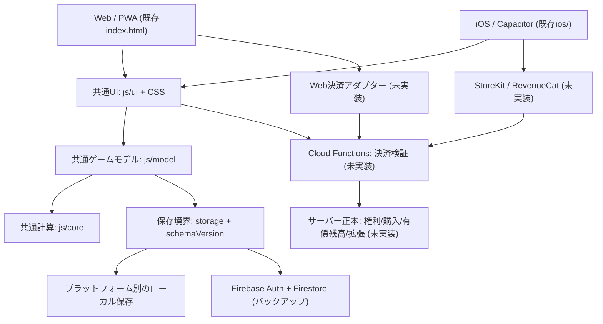

# ソードクレスト Web/iOS共通アーキテクチャ・移行計画

> 2026-10-08 | 方針: **Web/PWA先行公開 → Web課金導入 → iOS展開**。
> 状態: 設計と本番/検証分離の最初のコード変更。アカウント統合・購入サーバー・正式公開は未完了。

## 1. 全体像

- **実装済み**: バニラWebゲーム、戦闘/報酬/育成、CSS/DOM、PWA、Capacitor iOS土台、匿名クラウドバックアップ、localStorage抽象化、schemaVersion。
- **このPR**: ビルド時のPreview/Productionチャネル、productionで無料購入/デバッグを停止、Webリリース用出力の追加。
- **未実装**: Web/iOS共通のログイン、アカウントを跨いだセーブ復元、保存競合制御、サーバー購入台帳、Web/Apple決済、ネイティブ永続ストレージの採用。

## 2. コードの責務と境界

| 既存モジュール | 責務 | Web/iOS | 変更方針 |
|---|---|---|---|
| `js/core/*` | 純粋な戦闘・乱数・報酬・装備・強化計算 | 共通 | **0.05秒固定刻み・チーム別RNGはPR #63で実装済み**。回帰・実機負荷の検証が残る |
| `js/model/*` | ロスター・探索・所持品・セーブのモデル | 共通 | 端末セーブに有償購入の正本を持たせない |
| `js/ui/*` | ゲーム画面、操作、モーダル | 共通 | DOM UIを再利用。決済はプラットフォーム別アダプター経由 |
| `js/game.js` | 起動と離脱時セーブ・精算 | 共通 | iOSのライフサイクル対応を段階的に追加 |
| `js/core/storage.js` | 同期get/set互換の保存窓口 | 共通I/F | Web永続化・iOSファイル保存の実装差し替えを検証して追加 |
| `js/cloud.js` | Firebase匿名認証/バックアップ | 共通I/F | アカウント連携・revision照合を追加。認可はRules/App Check |
| `js/ui/notify.js` | 完了通知 | 個別 | 既存Capacitorローカル通知を維持、Webは将来別方式 |
| `tools/build-www.js` | 静的配布物を生成 | 配布先を分岐 | `www/` (iOS)、`dist/web/` (Web)を生成 |
| `js/runtime-env.js` | 検証用の実行モード初期値 | 配布物で切替 | Productionで開発機能/無料購入を停止。**認可には使わない** |

**原則**: ビジネスロジックはWeb/iOSで一つ。プラットフォーム固有なのは認証UI・保存実装・決済呼び出し・通知・審査関連に限る。共通エンジンを二重管理しない。

## 3. 環境分離とビルド

| 出力 | コマンド | 配布先 | 開発者モード | 無償テスト購入 | Firebase |
|---|---|---|---|---|---|
| 既存ソース/GitHub Pages | そのまま配信 | Previewのみ | 有効 | 有効 | 既存`sword-crest-jp` (検証) |
| Web検証ビルド | `npm run build:preview:web` | `dist/web/` | 有効 | 有効 | 既存プロトタイプ設定 |
| **Web Production候補** | `npm run build:release:web` | `dist/web/` | **実装をスタブ化** | **無効** | 別Firebaseの設定必須。未設定や試験プロジェクトならビルド失敗 |
| iOS検証 | `npm run cap:sync` | `www/`→iOS | 有効 | 有効 | 既存プロトタイプ設定 |
| **iOS Production候補** | `npm run cap:sync:release` | `www/`→iOS | **無効** | **無効** | 同じ本番用Firebase設定 |

- 本番用Firebase構成を使う場合は `SWORD_CREST_FIREBASE_CONFIG_JSON` (JSON文字列) をビルド環境変数に渡す。認証用の秘密鍵・決済シークレットは**ブラウザ配布物に入れない**。既存プロトタイプ `sword-crest-jp` の流用をビルドで拒否。
- ProductionビルドはFirebase構成のない状態、または試験プロジェクトを指定した場合は**失敗（Fail Closed）**する。CIは実際に接続できないテスト専用識別子で成果物のみ検証し、デプロイしない。
- Production成果物はデバッグ実装・合言葉ハッシュを無害なスタブに置き換え、無料テストショップを隠す。これは表示と誤操作の防止であり、購入の安全性は**サーバーで検証された台帳だけ**が保証する。
- 保存キーに `scprod:` を追加し、同じoriginに残る試験用セーブ・無料付与の自動取込みを避ける。**正式配布はさらにオリジンを分離する**。サービスワーカーのキャッシュ名も別にする。
- Productionのショップは決済実装まで閉鎖する。UIフラグが改ざんされても付与できないよう、正式決済時はCloud Functions側の検証/台帳でのみ確定する。
- `admin.html` は公開向けの `dist/web/`・`www/` に含めない。直接ソース配信のGitHub Pagesは**あくまでPreview**。
- Firebase Auth・Firestore・App Check・Rules、ホスティングドメイン、CIのデプロイ権限、利用規約/プライバシーポリシーをpreview/productionで分ける。公開ドメインはリリース時に確定し、ブラウザの保存オリジンが変わることを確認する。
- ソース中のクライアントフラグ、パスワードハッシュ、Firebase Web apiKeyはアクセス制御ではない。権限はサーバー・Firestore Rules側で強制する。

## 4. セーブ・アカウント統合（優先度3）

- データ正本: Lv・装備・通常強化石・踏破状況は端末、Firebaseはバックアップ。購入権利・有償石・購入履歴・BOX/キャラ付与台帳はサーバー正本。
- `schemaVersion`と検証済みマイグレーションを維持。匿名Authからリンク可能なゲームアカウントへ昇格させ、同じUIDまたはサーバー上で関連付けられた不変のゲームアカウントIDでセーブにアクセスする。
- 同じアカウントのWeb/PWA/iOSで保存・復元を提供。ログイン前に既存のセーブとクラウドを**自動マージしない**。確認画面で端末/クラウドを選択し、上書き対象と最終更新日時・revisionを明示。
- 複数端末/タブ: revisionベースの競合検知、他端末の更新時は自動上書きを止める。Tab間はBroadcastChannelなどとstorage eventで検知し、単一プレイタブへ誘導する。
- 購入復元はセーブ復元とは分離。古いローカルセーブを戻しても有償残高・購入権利が増えないこと。

## 5. 有料販売共通インターフェース（優先度6・7）

- UI: product ID と税込ローカライズ価格を決済SDKから取得。WebとiOSで商品と利用権利の意味をそろえる。
- Web決済: Stripe等のPSP候補。決済開始→サーバーの検証済みWebhook/照合→冪等台帳へ付与→UI反映。フロントエンドの成功画面だけで付与しない。
- iOS決済: StoreKit/RevenueCat等。購入情報/ストア取引IDをサーバー検証し、同じ台帳へ紐付ける。Apple規約上の外部購入導線と他プラットフォーム購入権利の取り扱いは審査前に確認。
- 買い切り: `billingId`に権利を紐付けて重複付与を防ぐ。Web購入・Apple購入の検証元を区別し、返金/取消を記録。
- 消耗品: `transactionId`/操作IDの冪等性を持つサーバートランザクションで加算・消費する。残高は端末セーブから算定しない。
- Webでも課金を始める場合、特商法表示、返金、税・決済事業者審査、未使用の有償アイテムに関する法令確認を販売前に実施。
- `docs/monetization-design.md` は商品・経済の詳細設計の正本。ここはプラットフォーム共通の技術境界を定める。

## 6. 実装順と受入条件

| 優先 | 変更単位 | 受入条件 |
|---|---|---|
| 1 | 設計更新 | 本書と`production-plan.md`の順序、共有境界、正本が一致 |
| 2 | ビルド分離 | Previewが維持され、Productionビルドに開発用画面と無料受取が出ない。検証用Firebaseを本番に混ぜない |
| 3 | アカウント移行 | Web→PWA→iOSで同じユーザーに復元、未連携/退会/旧セーブ/競合/再ログインを確認 |
| 4 | セーブ・戦闘 | 複数タブで巻き戻らない。x1/x5とオフラインが固定刻みで整合。低性能端末で4チーム×100周を検証 |
| 5 | 公開検証 | モバイルSafari/Chrome/PC、PWA、CSP/Rules/App Check、障害検出、費用アラート、データ初期化を確認 |
| 6 | 買い切り | Web決済→検証→権利付与→復元/返金まで本番相当のテスト。テスト購入の無償付与は本番では不可 |
| 7 | 消耗品 | 付与/消費/再送/二重クリック/古いセーブ/多端末/返金を確認。両商品種別が通って初回有料販売可 |
| 8 | iOS | Capacitor実機/テスト配信、StoreKitの検証、Webの共通アカウントと権利表示、審査条件を確認 |

## 7. 今回のスコープ外

- Previewの既存ユーザーを移行する仕様・自動移行プログラム、認証の追加、実際のStripe/Apple決済、Firebase本番プロジェクト作成・デプロイ、UIのReact等への全面再実装は、このブランチでは行わない。
- 本ブランチのビルド追加だけでは本番公開可能にはならない。運用担当による実機・クラウド設定確認が必要。
